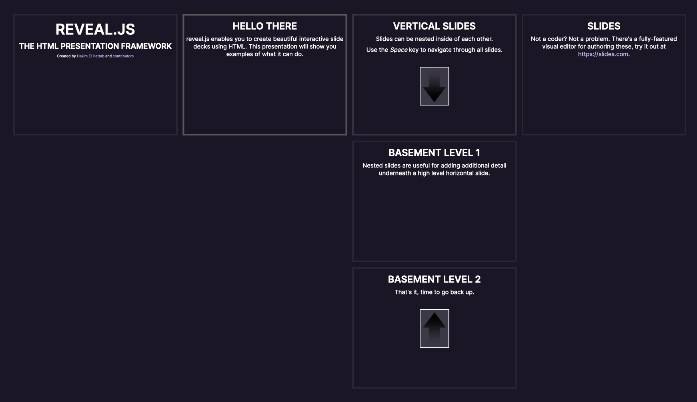

# Overview Mode

Overview Mode provides a bird's-eye view of all slides in the presentation, displayed as thumbnails in a grid layout. This allows users to see the entire presentation structure at once and navigate quickly to any slide.



---

## Activating Overview Mode

### Keyboard Shortcuts

Press **ESC** or **O** to toggle overview mode on and off:

| Key | Action |
|-----|--------|
| `ESC` | Toggle overview mode |
| `O` | Toggle overview mode |

**While in overview mode:**
- You can still navigate between slides using arrow keys
- Click any slide thumbnail to jump to it
- Press `ESC` or `O` again to exit overview mode and return to the clicked slide

---

## API Methods

### toggleOverview()

Programmatically control overview mode using the `toggleOverview()` API method.

```javascript
// Toggle: Switch to the opposite of the current state
Reveal.toggleOverview();

// Activate: Force overview mode on
Reveal.toggleOverview(true);

// Deactivate: Force overview mode off
Reveal.toggleOverview(false);
```

**Method signature:**
```typescript
toggleOverview(override?: boolean): void
```

**Parameters:**
- `override` (optional):
  - `true` = Force activate overview mode
  - `false` = Force deactivate overview mode
  - `undefined` = Toggle current state

### isOverview()

Check if overview mode is currently active:

```javascript
if (Reveal.isOverview()) {
  console.log('Overview mode is active');
} else {
  console.log('Normal presentation mode');
}
```

---

## Events

RevealJS fires events when entering and exiting overview mode. Use these events to trigger custom behavior.

### overviewshown

Fired when overview mode is activated:

```javascript
Reveal.on('overviewshown', (event) => {
  console.log('Entered overview mode');

  // Example: Pause video playback when entering overview
  document.querySelectorAll('video').forEach(video => {
    video.pause();
  });
});
```

**Event object:** Empty event object (no specific properties)

### overviewhidden

Fired when overview mode is deactivated:

```javascript
Reveal.on('overviewhidden', (event) => {
  console.log('Exited overview mode');

  // Example: Resume operations when returning to normal mode
  initializeSlideAnimations();
});
```

**Event object:** Empty event object (no specific properties)

### Event Flow Example

```javascript
Reveal.on('overviewshown', () => {
  console.log('1. Overview activated');
});

Reveal.on('overviewhidden', () => {
  console.log('2. Overview deactivated');
});

Reveal.on('slidechanged', (event) => {
  console.log('3. Navigated to slide:', event.indexh, event.indexv);
});

// User workflow:
// Press ESC ’ "1. Overview activated"
// Click slide ’ "2. Overview deactivated" ’ "3. Navigated to slide: 5 0"
```

---

## Visual Behavior

### Layout and Appearance

**Overview mode displays:**
- All slides as scaled-down thumbnails
- Grid layout (responsive to viewport size)
- Current slide highlighted with a border/indicator
- Vertical slide stacks shown inline with their parent slides

**Scaling:**
- Slides are uniformly scaled to fit in the grid
- Aspect ratio is preserved
- Complex slides (with animations, media) are shown in their initial state

### Navigation in Overview Mode

**Keyboard navigation:**
- Arrow keys move between slide thumbnails
- `Enter` or click to select a slide and exit overview
- `ESC` or `O` to exit without changing slides

**Mouse/touch:**
- Click/tap any thumbnail to jump to that slide
- Scroll to view more slides (if grid exceeds viewport)

---

## DOM Structure

When overview mode is activated, RevealJS applies the `.overview` class to the `.reveal` container:

```html
<!-- Normal mode -->
<div class="reveal">
  <div class="slides">
    <!-- slides -->
  </div>
</div>

<!-- Overview mode active -->
<div class="reveal overview">
  <div class="slides">
    <!-- slides -->
  </div>
</div>
```

**CSS class: `.overview`**
- Applied to `.reveal` element
- Used by RevealJS CSS to apply grid layout and scaling
- Can be targeted for custom styling

### Custom Styling

```css
/* Customize overview mode appearance */
.reveal.overview .slides section {
  border: 3px solid #42affa;
  opacity: 0.8;
}

.reveal.overview .slides section.present {
  border-color: #ff6b6b;
  opacity: 1;
}

/* Hide certain elements in overview mode */
.reveal.overview .hide-in-overview {
  display: none;
}
```

---

## Project Integration Notes

### Usage in Video Generation

**Overview mode is NOT typically used during video recording** because:
- It's an interactive navigation feature for live presentations
- Videos follow linear playback (no interactive navigation needed)
- Thumbnail grid doesn't make sense in sequential video format

**Possible use case:**
- Generate a "table of contents" screenshot from overview mode
- Include as a reference frame at the start of the video
- Show presentation structure to viewers

### Playwright Integration

If you need to capture overview mode for documentation:

```javascript
// Activate overview mode
await page.evaluate(() => Reveal.toggleOverview(true));

// Wait for transition
await page.waitForTimeout(500);

// Capture screenshot
await page.screenshot({ path: 'overview.png' });

// Exit overview mode
await page.evaluate(() => Reveal.toggleOverview(false));
```

---

## Configuration

Overview mode has **no dedicated configuration options**. It works out-of-the-box with default behavior.

However, related configurations may affect appearance:
- `center` - Whether slides are centered (affects thumbnail layout)
- `transition` - Transition style when entering/exiting overview (typically fade)

---

## Use Cases

### For Live Presentations

1. **Quick navigation**: Jump to any slide without sequential navigation
2. **Answering questions**: "Let me go back to that diagram..." (press ESC, click slide)
3. **Skipping content**: Quickly move past irrelevant sections
4. **Showing structure**: Give audience a sense of presentation organization

### For Presentation Editors

1. **Content review**: See all slides at once during editing
2. **Reordering**: Visual reference while rearranging slides
3. **Consistency check**: Spot visual inconsistencies across slides

### For Documentation

1. **Presentation preview**: Generate overview screenshot for README
2. **Content audit**: Visual inventory of all slides
3. **Navigation map**: Create clickable slide index

---

## Accessibility

**Keyboard support:**
- Full keyboard navigation (arrow keys, Enter, ESC)
- No mouse required

**Screen readers:**
- Overview mode may not be fully accessible to screen readers
- Slides are visually scaled but semantically unchanged
- Consider providing alternative navigation for accessibility

---

## Browser Compatibility

Overview mode works in all modern browsers:
- Chrome, Firefox, Safari, Edge
- Mobile browsers (iOS Safari, Chrome Mobile)
- Touch and mouse input supported

**Performance note:** Large presentations (100+ slides) may experience slowdown in overview mode due to rendering many scaled DOM elements.

---

## Best Practices

1. **Train your audience**: Mention ESC key for navigation at start of presentation
2. **Use sparingly during live talks**: Can be disorienting if overused
3. **Combine with slide numbers**: Helps audience reference specific slides
4. **Test with complex slides**: Ensure animations/media don't break thumbnail rendering
5. **Consider presentation size**: Very large decks may have cramped overview grid

---

## Common Issues and Solutions

### Issue: Overview thumbnails are blank

**Cause:** Slides haven't rendered yet
**Solution:** Ensure all slides have loaded before entering overview

```javascript
Reveal.on('ready', () => {
  // Safe to use overview mode now
  Reveal.toggleOverview();
});
```

### Issue: Media doesn't display in overview

**Cause:** Videos/iframes may not render in scaled thumbnails
**Solution:** This is expected behavior. Media shows in normal mode only.

### Issue: Text is unreadable in overview

**Cause:** Slides are heavily scaled down
**Solution:** Use high-contrast designs and larger fonts. Overview is for structure, not reading content.

---

## Related Features

- **[26-jump-to-slide.md](26-jump-to-slide.md)** - Alternative quick navigation method
- **[25-slide-numbers.md](25-slide-numbers.md)** - Display current position in presentation
- **[33-keyboard.md](33-keyboard.md)** - Full keyboard shortcut reference
- **[31-api-methods.md](31-api-methods.md)** - Navigation API methods

---

## API Reference Summary

| Method | Description | Usage |
|--------|-------------|-------|
| `toggleOverview()` | Toggle overview mode | `Reveal.toggleOverview()` |
| `toggleOverview(true)` | Activate overview mode | `Reveal.toggleOverview(true)` |
| `toggleOverview(false)` | Deactivate overview mode | `Reveal.toggleOverview(false)` |
| `isOverview()` | Check if overview is active | `Reveal.isOverview()` |

| Event | When Fired | Usage |
|-------|------------|-------|
| `overviewshown` | Overview mode activated | `Reveal.on('overviewshown', fn)` |
| `overviewhidden` | Overview mode deactivated | `Reveal.on('overviewhidden', fn)` |

---

## Summary

- **Purpose**: Bird's-eye view of all slides for quick navigation
- **Activation**: `ESC` or `O` key, or `Reveal.toggleOverview()` API
- **Navigation**: Arrow keys to move, click to jump, ESC to exit
- **Events**: `overviewshown` and `overviewhidden` for custom behavior
- **Use case**: Live presentations with interactive navigation needs
- **Not for video**: Linear video playback doesn't need overview mode
- **No configuration**: Works out-of-the-box with sensible defaults
